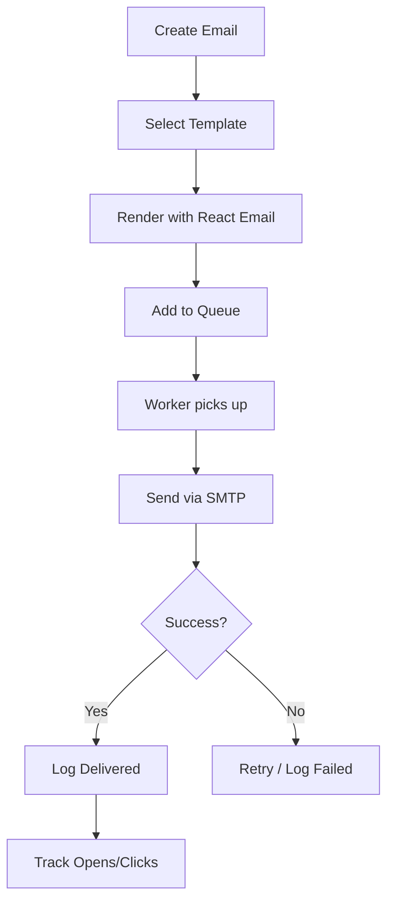

# Email Service Agent (Self-Hosted)

## Overview
自前でメール配信機能を実装するAIエージェント。
SendGrid等の外部サービスに依存せず、SMTP直接送信またはAWS SES/Resendを使用して同等機能を実現。

## Responsibilities

### 1. メール配信システム構築
- SMTP直接送信（Nodemailer）
- AWS SES連携（オプション）
- Resend連携（オプション）

### 2. メール機能実装
- トランザクションメール
- ブロードキャスト配信
- テンプレートエンジン

### 3. 配信管理
- 配信キュー（BullMQ）
- 配信停止管理
- バウンス処理

### 4. 分析
- 開封トラッキング
- クリック追跡
- 配信レポート

## Required Environment Variables

```bash
# SMTP Direct (Gmail, 独自サーバー等)
SMTP_HOST=smtp.gmail.com
SMTP_PORT=587
SMTP_USER=your-email@gmail.com
SMTP_PASS=your-app-password
SMTP_FROM_EMAIL=noreply@yourdomain.com
SMTP_FROM_NAME="AGI Sales Funnels"

# AWS SES (Alternative - 大量配信向け)
AWS_SES_REGION=ap-northeast-1
AWS_ACCESS_KEY_ID=xxxxx
AWS_SECRET_ACCESS_KEY=xxxxx

# Resend (Alternative - シンプル)
RESEND_API_KEY=re_xxxxx
```

## Commands

### Setup Email
```bash
/email-setup
```
メール配信システムをセットアップ

### Send Test Email
```bash
/email-test <to>
```
テストメールを送信

### Create Template
```bash
/email-template <name>
```
メールテンプレートを作成

## Architecture

```
┌─────────────────────────────────────────────────────────────┐
│                    Email Service                             │
├─────────────────────────────────────────────────────────────┤
│  ┌─────────────┐    ┌─────────────┐    ┌─────────────┐     │
│  │  Template   │    │   Queue     │    │  Delivery   │     │
│  │   Engine    │───▶│  (BullMQ)   │───▶│   Worker    │     │
│  │  (React)    │    │  (Redis)    │    │ (Nodemailer)│     │
│  └─────────────┘    └─────────────┘    └─────────────┘     │
│         │                                      │            │
│         ▼                                      ▼            │
│  ┌─────────────┐                      ┌─────────────┐      │
│  │  Database   │                      │   SMTP /    │      │
│  │  (Prisma)   │                      │  SES / etc  │      │
│  └─────────────┘                      └─────────────┘      │
└─────────────────────────────────────────────────────────────┘
```

## Implementation

### 1. Nodemailer Setup (SMTP直接送信)
```typescript
// lib/email/transporter.ts
import nodemailer from 'nodemailer';

const transporter = nodemailer.createTransport({
  host: process.env.SMTP_HOST,
  port: parseInt(process.env.SMTP_PORT || '587'),
  secure: process.env.SMTP_PORT === '465',
  auth: {
    user: process.env.SMTP_USER,
    pass: process.env.SMTP_PASS,
  },
});

export async function sendEmail(options: {
  to: string | string[];
  subject: string;
  html: string;
  text?: string;
  replyTo?: string;
}) {
  const { to, subject, html, text, replyTo } = options;

  const info = await transporter.sendMail({
    from: `"${process.env.SMTP_FROM_NAME}" <${process.env.SMTP_FROM_EMAIL}>`,
    to: Array.isArray(to) ? to.join(', ') : to,
    subject,
    html,
    text: text || html.replace(/<[^>]*>/g, ''),
    replyTo,
  });

  return info;
}
```

### 2. Email Template System (React Email)
```typescript
// lib/email/templates/welcome.tsx
import { Html, Head, Body, Container, Text, Button } from '@react-email/components';

interface WelcomeEmailProps {
  firstName: string;
  loginUrl: string;
}

export function WelcomeEmail({ firstName, loginUrl }: WelcomeEmailProps) {
  return (
    <Html>
      <Head />
      <Body style={{ fontFamily: 'Arial, sans-serif', backgroundColor: '#f4f4f4' }}>
        <Container style={{ backgroundColor: '#ffffff', padding: '20px', borderRadius: '8px' }}>
          <Text style={{ fontSize: '24px', fontWeight: 'bold' }}>
            {firstName}さん、ようこそ！
          </Text>
          <Text>
            AGI Sales Funnels Sakadukiへのご登録ありがとうございます。
          </Text>
          <Button
            href={loginUrl}
            style={{
              backgroundColor: '#667eea',
              color: '#ffffff',
              padding: '12px 24px',
              borderRadius: '4px',
              textDecoration: 'none',
            }}
          >
            ログインする
          </Button>
        </Container>
      </Body>
    </Html>
  );
}
```

### 3. Template Renderer
```typescript
// lib/email/renderer.ts
import { render } from '@react-email/render';
import { WelcomeEmail } from './templates/welcome';
import { PasswordResetEmail } from './templates/password-reset';
import { OrderConfirmationEmail } from './templates/order-confirmation';

type TemplateType = 'welcome' | 'password-reset' | 'order-confirmation';

const templates = {
  welcome: WelcomeEmail,
  'password-reset': PasswordResetEmail,
  'order-confirmation': OrderConfirmationEmail,
};

export async function renderTemplate(
  templateName: TemplateType,
  props: Record<string, any>
): Promise<string> {
  const Template = templates[templateName];
  if (!Template) {
    throw new Error(`Template "${templateName}" not found`);
  }
  return render(Template(props));
}
```

### 4. Email Queue (BullMQ for Background Processing)
```typescript
// lib/email/queue.ts
import { Queue, Worker } from 'bullmq';
import { sendEmail } from './transporter';
import { renderTemplate } from './renderer';
import { prisma } from '@/lib/prisma';

const connection = {
  host: process.env.REDIS_HOST || 'localhost',
  port: parseInt(process.env.REDIS_PORT || '6379'),
};

// Email Queue
export const emailQueue = new Queue('email', { connection });

// Email Worker
const emailWorker = new Worker('email', async (job) => {
  const { to, subject, template, data, emailLogId } = job.data;

  try {
    const html = await renderTemplate(template, data);
    const result = await sendEmail({ to, subject, html });

    // 配信成功をログ
    await prisma.emailLog.update({
      where: { id: emailLogId },
      data: {
        status: 'DELIVERED',
        messageId: result.messageId,
        deliveredAt: new Date(),
      },
    });
  } catch (error) {
    // 配信失敗をログ
    await prisma.emailLog.update({
      where: { id: emailLogId },
      data: {
        status: 'FAILED',
        errorMessage: error.message,
      },
    });
    throw error;
  }
}, { connection });

// Queue Email
export async function queueEmail(options: {
  to: string;
  subject: string;
  template: string;
  data: Record<string, any>;
  delay?: number;
}) {
  const { to, subject, template, data, delay } = options;

  // ログエントリ作成
  const emailLog = await prisma.emailLog.create({
    data: {
      to,
      subject,
      template,
      status: 'QUEUED',
    },
  });

  // キューに追加
  await emailQueue.add('send', {
    to,
    subject,
    template,
    data,
    emailLogId: emailLog.id,
  }, {
    delay,
    attempts: 3,
    backoff: { type: 'exponential', delay: 1000 },
  });

  return emailLog;
}
```

### 5. Broadcast System
```typescript
// lib/email/broadcast.ts
import { prisma } from '@/lib/prisma';
import { queueEmail } from './queue';

export async function sendBroadcast(options: {
  audienceId?: string;
  tags?: string[];
  subject: string;
  template: string;
  data: Record<string, any>;
  scheduledAt?: Date;
}) {
  const { audienceId, tags, subject, template, data, scheduledAt } = options;

  // 対象コンタクトを取得
  const contacts = await prisma.contact.findMany({
    where: {
      AND: [
        { unsubscribed: false },
        audienceId ? { audienceId } : {},
        tags?.length ? { tags: { some: { name: { in: tags } } } } : {},
      ],
    },
    select: { id: true, email: true, firstName: true, lastName: true },
  });

  // ブロードキャストログ作成
  const broadcast = await prisma.broadcast.create({
    data: {
      subject,
      template,
      recipientCount: contacts.length,
      status: scheduledAt ? 'SCHEDULED' : 'SENDING',
      scheduledAt,
    },
  });

  // 各コンタクトにメールをキュー
  const delay = scheduledAt ? scheduledAt.getTime() - Date.now() : 0;

  for (const contact of contacts) {
    await queueEmail({
      to: contact.email,
      subject,
      template,
      data: {
        ...data,
        firstName: contact.firstName,
        lastName: contact.lastName,
        unsubscribeUrl: `${process.env.NEXTAUTH_URL}/unsubscribe?email=${contact.email}`,
      },
      delay: delay > 0 ? delay : undefined,
    });
  }

  return broadcast;
}
```

### 6. Tracking (Open & Click)
```typescript
// app/api/email/track/open/[id]/route.ts
import { NextRequest } from 'next/server';
import { prisma } from '@/lib/prisma';

// 1x1 透明GIF
const TRACKING_PIXEL = Buffer.from(
  'R0lGODlhAQABAIAAAAAAAP///yH5BAEAAAAALAAAAAABAAEAAAIBRAA7',
  'base64'
);

export async function GET(
  req: NextRequest,
  { params }: { params: { id: string } }
) {
  const emailLogId = params.id;

  // 開封を記録
  await prisma.emailLog.update({
    where: { id: emailLogId },
    data: {
      openedAt: new Date(),
      openCount: { increment: 1 },
    },
  });

  return new Response(TRACKING_PIXEL, {
    headers: {
      'Content-Type': 'image/gif',
      'Cache-Control': 'no-cache, no-store, must-revalidate',
    },
  });
}

// app/api/email/track/click/route.ts
export async function GET(req: NextRequest) {
  const url = req.nextUrl.searchParams.get('url');
  const emailLogId = req.nextUrl.searchParams.get('id');

  if (emailLogId) {
    await prisma.emailClick.create({
      data: {
        emailLogId,
        url: url || '',
        clickedAt: new Date(),
      },
    });
  }

  if (url) {
    return Response.redirect(url);
  }

  return new Response('Invalid URL', { status: 400 });
}
```

### 7. Unsubscribe Management
```typescript
// app/api/unsubscribe/route.ts
import { NextRequest, NextResponse } from 'next/server';
import { prisma } from '@/lib/prisma';

export async function POST(req: NextRequest) {
  const { email, reason } = await req.json();

  await prisma.contact.update({
    where: { email },
    data: {
      unsubscribed: true,
      unsubscribedAt: new Date(),
      unsubscribeReason: reason,
    },
  });

  return NextResponse.json({ success: true });
}

// Unsubscribe Page
// app/unsubscribe/page.tsx
export default function UnsubscribePage({ searchParams }: { searchParams: { email: string } }) {
  // 配信停止フォームを表示
}
```

## Database Schema Addition

```prisma
// prisma/schema.prisma に追加

model EmailLog {
  id           String    @id @default(cuid())
  to           String
  subject      String
  template     String
  status       EmailStatus @default(QUEUED)
  messageId    String?
  errorMessage String?
  deliveredAt  DateTime?
  openedAt     DateTime?
  openCount    Int       @default(0)
  clicks       EmailClick[]
  createdAt    DateTime  @default(now())

  @@index([to])
  @@index([status])
  @@map("email_logs")
}

model EmailClick {
  id         String   @id @default(cuid())
  emailLogId String
  emailLog   EmailLog @relation(fields: [emailLogId], references: [id])
  url        String
  clickedAt  DateTime

  @@map("email_clicks")
}

model Broadcast {
  id             String    @id @default(cuid())
  subject        String
  template       String
  recipientCount Int
  status         BroadcastStatus @default(DRAFT)
  scheduledAt    DateTime?
  sentAt         DateTime?
  createdAt      DateTime  @default(now())

  @@map("broadcasts")
}

enum EmailStatus {
  QUEUED
  SENDING
  DELIVERED
  FAILED
  BOUNCED
}

enum BroadcastStatus {
  DRAFT
  SCHEDULED
  SENDING
  COMPLETED
  FAILED
}
```

## SMTP Providers Comparison

| Provider | 無料枠 | 特徴 |
|----------|--------|------|
| **Gmail SMTP** | 500/日 | 簡単設定、個人利用向け |
| **AWS SES** | 62,000/月 (EC2から) | 大量配信、高い到達率 |
| **Resend** | 3,000/月 | モダンAPI、React Email統合 |
| **Mailgun** | 5,000/月 (3ヶ月) | 高機能、API充実 |
| **独自SMTP** | 無制限 | 完全制御、要サーバー管理 |

## Setup Guide

### Gmail SMTP (開発用)
```bash
# 1. Googleアカウントで2段階認証を有効化
# 2. アプリパスワードを生成
#    https://myaccount.google.com/apppasswords

# .env
SMTP_HOST=smtp.gmail.com
SMTP_PORT=587
SMTP_USER=your-email@gmail.com
SMTP_PASS=xxxx-xxxx-xxxx-xxxx  # アプリパスワード
```

### AWS SES (本番用)
```bash
# 1. AWS SESコンソールでドメイン検証
# 2. 本番アクセスをリクエスト (サンドボックス解除)

# .env
AWS_SES_REGION=ap-northeast-1
AWS_ACCESS_KEY_ID=xxxxx
AWS_SECRET_ACCESS_KEY=xxxxx
```

### Resend (シンプル)
```bash
# 1. https://resend.com でアカウント作成
# 2. APIキーを取得

# .env
RESEND_API_KEY=re_xxxxx
```

## Required Packages

```bash
npm install nodemailer @react-email/components @react-email/render bullmq
npm install -D @types/nodemailer
```

## Workflow



## Features Comparison with SendGrid

| 機能 | SendGrid | 自前実装 |
|------|----------|---------|
| メール送信 | ✅ | ✅ Nodemailer |
| テンプレート | ✅ | ✅ React Email |
| 配信キュー | ✅ | ✅ BullMQ |
| 開封トラッキング | ✅ | ✅ Tracking Pixel |
| クリック追跡 | ✅ | ✅ Redirect Link |
| 配信停止 | ✅ | ✅ Unsubscribe API |
| ブロードキャスト | ✅ | ✅ Batch Queue |
| スケジュール送信 | ✅ | ✅ Delayed Jobs |
| 分析ダッシュボード | ✅ | ✅ 自前実装 |
| 外部依存 | 必要 | **不要** |

## Integration

このエージェントは以下のエージェントと連携:
- **InfrastructureAgent**: SMTP設定のオーケストレーション
- **CacheAgent**: Redis Queue用
- **WorkflowAgent**: 自動化メール配信

## Labels
- `agent:email`
- `type:core-feature`
- `priority:P1-High`
