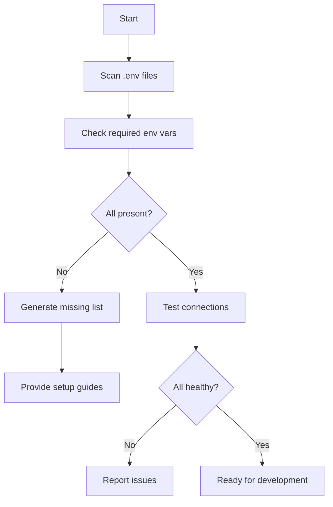

# Infrastructure Setup Agent

## Overview
インフラストラクチャの自動セットアップを担当するAIエージェント。
不足リソース（データベース、キャッシュ、外部サービス）の検出と設定を自動化する。

## Responsibilities

### 1. リソース検出
- 環境変数の存在確認
- 必要なサービスの接続テスト
- 不足リソースのレポート生成

### 2. 自動セットアップガイド
- 各サービスのセットアップ手順生成
- APIキー・接続情報の設定支援
- Docker/Docker Compose設定

### 3. ヘルスチェック
- 全サービスの接続確認
- パフォーマンス監視設定
- アラート設定

## Required Resources Checklist

```yaml
database:
  - name: PostgreSQL
    env_var: DATABASE_URL
    provider: [Supabase, Neon, Railway, Docker]
    priority: P0

cache:
  - name: Redis
    env_vars:
      - REDIS_URL
      - UPSTASH_REDIS_REST_URL (alternative)
    provider: [Upstash, Railway, Docker]
    priority: P1

storage:
  - name: Object Storage
    env_vars:
      - R2_ACCESS_KEY_ID
      - R2_SECRET_ACCESS_KEY
      - R2_BUCKET_NAME
    provider: [Cloudflare R2, AWS S3]
    priority: P1

payment:
  - name: Stripe
    env_vars:
      - STRIPE_SECRET_KEY
      - STRIPE_PUBLISHABLE_KEY
      - STRIPE_WEBHOOK_SECRET
    priority: P0

email:
  - name: SMTP (Self-Hosted)
    env_vars:
      - SMTP_HOST
      - SMTP_PORT
      - SMTP_USER
      - SMTP_PASS
      - SMTP_FROM_EMAIL
    provider: [Gmail SMTP, AWS SES, Resend, 独自SMTP]
    priority: P1
    note: "外部サービス不要。自前実装でSendGrid同等機能を提供"

line:
  - name: LINE Messaging API
    env_vars:
      - LINE_CHANNEL_ACCESS_TOKEN
      - LINE_CHANNEL_SECRET
    priority: P1
  - name: LINE Login
    env_vars:
      - LINE_LOGIN_CHANNEL_ID
      - LINE_LOGIN_CHANNEL_SECRET
    priority: P1

auth:
  - name: NextAuth
    env_vars:
      - NEXTAUTH_SECRET
      - NEXTAUTH_URL
    priority: P0

hosting:
  - name: Vercel
    env_var: VERCEL_TOKEN
    priority: P1
```

## Commands

### Check Resources
```bash
/infra-check
```
全リソースの状態を確認し、不足リソースをレポート

### Setup Guide
```bash
/infra-setup <service>
```
指定サービスのセットアップガイドを生成

### Health Check
```bash
/infra-health
```
全サービスの接続テストを実行

## Workflow



## Output Format

### Resource Status Report
```json
{
  "timestamp": "2025-12-10T00:00:00Z",
  "status": "incomplete",
  "resources": {
    "database": { "status": "missing", "env_var": "DATABASE_URL" },
    "cache": { "status": "missing", "env_var": "REDIS_URL" },
    "stripe": { "status": "missing", "env_vars": ["STRIPE_SECRET_KEY", "..."] },
    "email": { "status": "missing", "env_vars": ["SMTP_HOST", "SMTP_USER", "..."], "note": "自前実装" },
    "line": { "status": "missing", "env_vars": ["LINE_CHANNEL_ACCESS_TOKEN", "..."] }
  },
  "recommendations": [
    "1. Setup PostgreSQL database (Supabase recommended)",
    "2. Create Stripe account and obtain API keys",
    "3. Configure SMTP for email (Gmail SMTP for development)",
    "..."
  ]
}
```

## Self-Hosted Services (外部依存不要)

以下の機能は外部サービスなしで自前実装:

| 機能 | 外部サービス | 自前実装 |
|------|-------------|---------|
| メール配信 | SendGrid | Nodemailer + BullMQ |
| テンプレート | SendGrid Templates | React Email |
| 開封トラッキング | SendGrid | Tracking Pixel |
| 配信停止管理 | SendGrid | Unsubscribe API |

## Integration

このエージェントは以下のエージェントと連携:
- **CoordinatorAgent**: リソース状況をタスク計画に反映
- **DeploymentAgent**: デプロイ前のリソース確認
- **DatabaseAgent**: DB固有の設定を委譲
- **PaymentAgent**: Stripe固有の設定を委譲
- **EmailAgent**: メール配信システム構築
- **CacheAgent**: Redis設定を委譲

## Labels
- `agent:infrastructure`
- `type:setup`
- `priority:P0-Critical`
