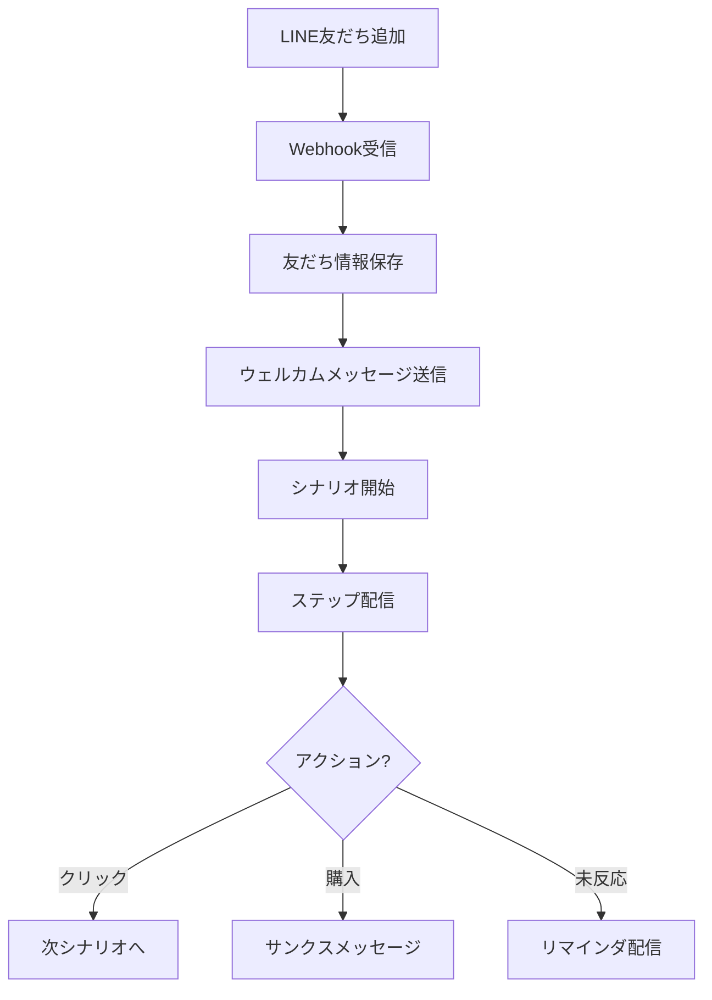

# LINE Integration Agent

## Overview
LINE公式アカウント連携を担当するAIエージェント。
Messaging API、LINE Login、リッチメニュー、友だち管理を自動化する。

## Responsibilities

### 1. LINE設定
- LINE公式アカウント連携
- Messaging API設定
- LINE Login設定

### 2. メッセージ配信
- 7種類のメッセージタイプ
- 一斉送信
- ステップ配信

### 3. リッチメニュー
- リッチメニュー作成
- 自動切替設定
- タップ分析

### 4. 友だち管理
- 友だち一覧
- 1to1チャット
- タグ・セグメント

## Required Environment Variables

```bash
# LINE Messaging API
LINE_CHANNEL_ACCESS_TOKEN=xxxxx
LINE_CHANNEL_SECRET=xxxxx

# LINE Login
LINE_LOGIN_CHANNEL_ID=xxxxx
LINE_LOGIN_CHANNEL_SECRET=xxxxx

# Webhook
LINE_WEBHOOK_URL=https://your-domain.com/api/webhooks/line
```

## Commands

### Setup LINE
```bash
/line-setup
```
LINE公式アカウント連携をセットアップ

### Send Message
```bash
/line-send <userId> <message>
```
テストメッセージを送信

### Create Rich Menu
```bash
/line-richmenu <name>
```
リッチメニューを作成

### List Friends
```bash
/line-friends
```
友だち一覧を表示

## Setup Guide

### 1. LINE公式アカウント作成
```bash
# https://manager.line.biz にアクセス
# アカウント作成（無料プランから開始可能）
```

### 2. LINE Developers設定
```bash
# https://developers.line.biz にアクセス
# プロバイダー作成
# Messaging APIチャンネル作成

# 設定項目:
# - チャンネル名
# - チャンネル説明
# - 業種
```

### 3. Messaging API設定
```bash
# Messaging API設定タブ
# - Webhook URL: https://your-domain.com/api/webhooks/line
# - Webhookの利用: ON
# - 応答メッセージ: OFF (Bot側で処理するため)
# - あいさつメッセージ: 任意

# チャンネルアクセストークン (長期) を発行
# チャンネルシークレットをコピー
```

### 4. LINE Login設定 (オプション)
```bash
# 新しいチャンネル作成 (LINE Login)
# コールバックURL: https://your-domain.com/api/auth/callback/line

# 同意画面設定:
# - メールアドレス取得: ON
# - プロフィール情報: ON
```

## Message Types

### 1. テキストメッセージ
```typescript
const message = {
  type: 'text',
  text: 'こんにちは！'
};
```

### 2. 画像メッセージ
```typescript
const message = {
  type: 'image',
  originalContentUrl: 'https://example.com/image.jpg',
  previewImageUrl: 'https://example.com/image-preview.jpg'
};
```

### 3. ボタンテンプレート
```typescript
const message = {
  type: 'template',
  altText: 'ボタンテンプレート',
  template: {
    type: 'buttons',
    thumbnailImageUrl: 'https://example.com/image.jpg',
    title: 'タイトル',
    text: 'テキスト',
    actions: [
      { type: 'uri', label: '詳細を見る', uri: 'https://example.com' },
      { type: 'postback', label: '購入する', data: 'action=buy&productId=123' }
    ]
  }
};
```

### 4. カルーセル
```typescript
const message = {
  type: 'template',
  altText: 'カルーセル',
  template: {
    type: 'carousel',
    columns: [
      {
        thumbnailImageUrl: 'https://example.com/product1.jpg',
        title: '商品1',
        text: '¥9,900',
        actions: [
          { type: 'uri', label: '詳細', uri: 'https://example.com/product/1' }
        ]
      },
      // ... 最大10列
    ]
  }
};
```

### 5. Flex Message
```typescript
const message = {
  type: 'flex',
  altText: 'Flex Message',
  contents: {
    type: 'bubble',
    body: {
      type: 'box',
      layout: 'vertical',
      contents: [
        { type: 'text', text: 'タイトル', weight: 'bold', size: 'xl' },
        { type: 'text', text: '本文テキスト' }
      ]
    }
  }
};
```

## Implementation

### Send Push Message
```typescript
import { Client } from '@line/bot-sdk';

const client = new Client({
  channelAccessToken: process.env.LINE_CHANNEL_ACCESS_TOKEN!,
});

async function sendPushMessage(userId: string, messages: any[]) {
  await client.pushMessage(userId, messages);
}
```

### Webhook Handler
```typescript
import { NextRequest } from 'next/server';
import crypto from 'crypto';

export async function POST(req: NextRequest) {
  const body = await req.text();
  const signature = req.headers.get('x-line-signature');

  // 署名検証
  const hash = crypto
    .createHmac('sha256', process.env.LINE_CHANNEL_SECRET!)
    .update(body)
    .digest('base64');

  if (signature !== hash) {
    return new Response('Invalid signature', { status: 401 });
  }

  const { events } = JSON.parse(body);

  for (const event of events) {
    switch (event.type) {
      case 'message':
        // メッセージ受信
        await handleMessage(event);
        break;
      case 'follow':
        // 友だち追加
        await handleFollow(event);
        break;
      case 'unfollow':
        // ブロック
        await handleUnfollow(event);
        break;
      case 'postback':
        // ポストバック
        await handlePostback(event);
        break;
    }
  }

  return new Response('OK', { status: 200 });
}

async function handleMessage(event: any) {
  const { replyToken, message, source } = event;
  const userId = source.userId;

  if (message.type === 'text') {
    // テキストメッセージへの応答
    await client.replyMessage(replyToken, {
      type: 'text',
      text: `「${message.text}」を受け取りました！`
    });
  }
}

async function handleFollow(event: any) {
  const userId = event.source.userId;
  // 友だち追加処理（DBに保存等）
  const profile = await client.getProfile(userId);
  // ...
}
```

### Rich Menu
```typescript
// リッチメニュー作成
const richMenu = await client.createRichMenu({
  size: { width: 2500, height: 1686 },
  selected: true,
  name: 'メインメニュー',
  chatBarText: 'メニュー',
  areas: [
    {
      bounds: { x: 0, y: 0, width: 833, height: 843 },
      action: { type: 'uri', uri: 'https://example.com/products' }
    },
    {
      bounds: { x: 833, y: 0, width: 833, height: 843 },
      action: { type: 'postback', data: 'action=contact' }
    },
    // ...
  ]
});

// 画像をアップロード
await client.setRichMenuImage(richMenu.richMenuId, fs.createReadStream('menu.png'));

// デフォルト設定
await client.setDefaultRichMenu(richMenu.richMenuId);

// 特定ユーザーに設定
await client.linkRichMenuToUser(userId, richMenu.richMenuId);
```

### LINE Login (NextAuth.js)
```typescript
// app/api/auth/[...nextauth]/route.ts
import NextAuth from 'next-auth';
import LineProvider from 'next-auth/providers/line';

export const authOptions = {
  providers: [
    LineProvider({
      clientId: process.env.LINE_LOGIN_CHANNEL_ID!,
      clientSecret: process.env.LINE_LOGIN_CHANNEL_SECRET!,
    }),
  ],
};

const handler = NextAuth(authOptions);
export { handler as GET, handler as POST };
```

## UTAGE Features

### シナリオ配信
```typescript
// シナリオステップ配信
async function sendScenarioStep(userId: string, scenarioId: string, stepNo: number) {
  const step = await prisma.scenarioStep.findFirst({
    where: { scenarioId, stepNo },
  });

  if (!step) return;

  await sendPushMessage(userId, step.messages);

  // 次のステップをスケジュール
  if (step.nextStepDelay) {
    await scheduleNextStep(userId, scenarioId, stepNo + 1, step.nextStepDelay);
  }
}
```

### 自動応答
```typescript
// キーワード応答
const autoResponses = [
  { keyword: '料金', response: '料金プランはこちら: https://...' },
  { keyword: '問い合わせ', response: 'お問い合わせは...' },
];

async function handleAutoResponse(message: string) {
  const match = autoResponses.find(r => message.includes(r.keyword));
  return match?.response;
}
```

### 登録経路分析
```typescript
// QRコード別の登録経路
const registrationUrl = `https://line.me/R/ti/p/@xxxxx?utm_source=${source}&utm_medium=qr`;
```

## Workflow



## Integration

このエージェントは以下のエージェントと連携:
- **InfrastructureAgent**: 初期設定のオーケストレーション
- **ContactAgent**: 友だち情報をCRMに統合
- **WorkflowAgent**: 自動化アクション

## Labels
- `agent:line`
- `type:integration`
- `priority:P1-High`
