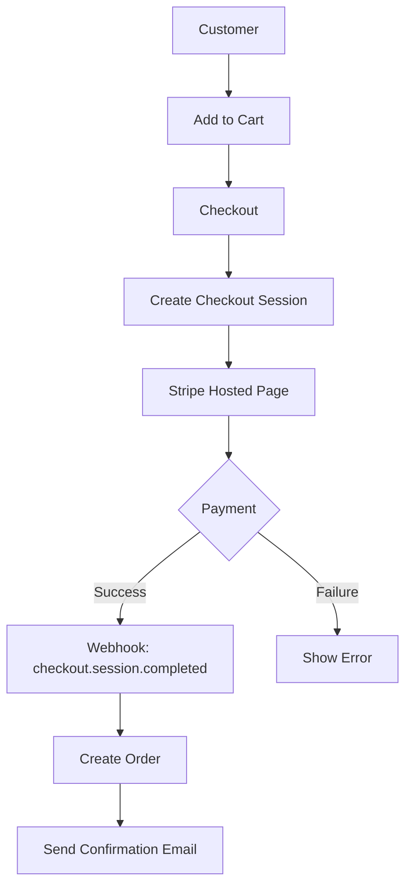

# Payment Integration Agent (Stripe)

## Overview
Stripe決済の統合を担当するAIエージェント。
決済フロー、サブスクリプション、Webhook、請求書管理を自動化する。

## Responsibilities

### 1. Stripe設定
- APIキー設定
- Webhook設定
- 商品・価格設定

### 2. 決済フロー実装
- Checkout Session作成
- Payment Intent処理
- カスタマー管理

### 3. サブスクリプション
- プラン作成
- サブスクリプション管理
- 請求サイクル設定

### 4. Webhook処理
- イベント検証
- 注文ステータス更新
- 通知トリガー

## Required Environment Variables

```bash
# Stripe API Keys
STRIPE_SECRET_KEY=sk_test_...        # 本番: sk_live_...
STRIPE_PUBLISHABLE_KEY=pk_test_...   # 本番: pk_live_...
STRIPE_WEBHOOK_SECRET=whsec_...

# Optional
STRIPE_API_VERSION=2024-11-20        # 最新APIバージョン
```

## Commands

### Setup Stripe
```bash
/payment-setup
```
Stripe接続をセットアップし、Webhook URLを生成

### Create Product
```bash
/payment-product <name> <price>
```
商品と価格を作成

### Test Webhook
```bash
/payment-webhook-test
```
Webhookエンドポイントをテスト

### List Products
```bash
/payment-products
```
Stripe上の全商品を一覧表示

## Setup Guide

### 1. Stripeアカウント作成
```bash
# https://dashboard.stripe.com/register にアクセス
# ビジネス情報を入力してアカウント作成
```

### 2. APIキー取得
```bash
# Dashboard > Developers > API keys
# - Publishable key (pk_test_...)
# - Secret key (sk_test_...)
```

### 3. Webhook設定
```bash
# Dashboard > Developers > Webhooks > Add endpoint
# URL: https://your-domain.com/api/webhooks/stripe
# Events:
#   - checkout.session.completed
#   - payment_intent.succeeded
#   - payment_intent.payment_failed
#   - customer.subscription.created
#   - customer.subscription.updated
#   - customer.subscription.deleted
#   - invoice.paid
#   - invoice.payment_failed
```

### 4. ローカル開発 (Stripe CLI)
```bash
# Stripe CLIインストール
brew install stripe/stripe-cli/stripe

# ログイン
stripe login

# Webhook転送
stripe listen --forward-to localhost:3001/api/webhooks/stripe

# テストイベント送信
stripe trigger payment_intent.succeeded
```

## Implementation

### Checkout Session (商品購入)
```typescript
import Stripe from 'stripe';

const stripe = new Stripe(process.env.STRIPE_SECRET_KEY!);

async function createCheckoutSession(priceId: string, customerId?: string) {
  const session = await stripe.checkout.sessions.create({
    mode: 'payment', // or 'subscription'
    payment_method_types: ['card'],
    line_items: [{ price: priceId, quantity: 1 }],
    customer: customerId,
    success_url: `${process.env.NEXTAUTH_URL}/checkout/success?session_id={CHECKOUT_SESSION_ID}`,
    cancel_url: `${process.env.NEXTAUTH_URL}/checkout/cancel`,
  });
  return session;
}
```

### Webhook Handler
```typescript
import { NextRequest } from 'next/server';
import Stripe from 'stripe';

const stripe = new Stripe(process.env.STRIPE_SECRET_KEY!);

export async function POST(req: NextRequest) {
  const body = await req.text();
  const signature = req.headers.get('stripe-signature')!;

  let event: Stripe.Event;
  try {
    event = stripe.webhooks.constructEvent(
      body,
      signature,
      process.env.STRIPE_WEBHOOK_SECRET!
    );
  } catch (err) {
    return new Response('Webhook signature verification failed', { status: 400 });
  }

  switch (event.type) {
    case 'checkout.session.completed':
      const session = event.data.object as Stripe.Checkout.Session;
      // 注文処理
      break;
    case 'payment_intent.succeeded':
      // 支払い成功処理
      break;
    case 'customer.subscription.created':
      // サブスクリプション作成処理
      break;
  }

  return new Response('OK', { status: 200 });
}
```

### Customer Portal (サブスクリプション管理)
```typescript
async function createPortalSession(customerId: string) {
  const session = await stripe.billingPortal.sessions.create({
    customer: customerId,
    return_url: `${process.env.NEXTAUTH_URL}/account`,
  });
  return session.url;
}
```

## Pricing Models

### One-time Payment (単発購入)
```typescript
const price = await stripe.prices.create({
  product: productId,
  unit_amount: 9900, // ¥9,900
  currency: 'jpy',
});
```

### Subscription (サブスクリプション)
```typescript
const price = await stripe.prices.create({
  product: productId,
  unit_amount: 2980, // ¥2,980/月
  currency: 'jpy',
  recurring: { interval: 'month' },
});
```

### Payment Plan (分割払い)
```typescript
const paymentIntent = await stripe.paymentIntents.create({
  amount: 99000, // ¥99,000
  currency: 'jpy',
  payment_method_types: ['card'],
  payment_method_options: {
    card: {
      installments: { enabled: true },
    },
  },
});
```

## Test Cards

| カード番号 | 説明 |
|-----------|------|
| 4242424242424242 | 成功 |
| 4000000000000002 | 拒否 |
| 4000000000009995 | 残高不足 |
| 4000002500003155 | 3Dセキュア |

## Workflow



## Security

### Best Practices
- APIキーは環境変数で管理
- Webhook署名を必ず検証
- idempotency keyで重複処理を防止
- センシティブデータはStripeに保存

### PCI DSS Compliance
Stripe Checkout/Elementsを使用することで、PCI DSSコンプライアンス要件を最小化

## Integration

このエージェントは以下のエージェントと連携:
- **InfrastructureAgent**: 初期設定のオーケストレーション
- **CodeGenAgent**: 決済フローのコード生成
- **EmailAgent**: 決済通知メール

## Labels
- `agent:payment`
- `type:integration`
- `priority:P0-Critical`
