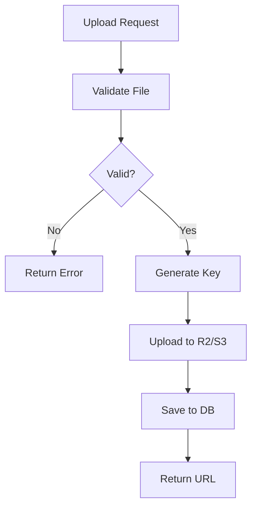

# Storage Agent (Cloudflare R2 / AWS S3)

## Overview
ファイルストレージの管理を担当するAIエージェント。
画像、動画、ドキュメントのアップロード、配信、最適化を自動化する。

## Responsibilities

### 1. ストレージ設定
- Cloudflare R2 / AWS S3設定
- バケット作成
- アクセス権限設定

### 2. ファイル管理
- アップロード処理
- ダウンロードURL生成
- ファイル削除

### 3. 画像最適化
- リサイズ
- フォーマット変換
- CDN配信

### 4. セキュリティ
- 署名付きURL
- アクセス制御
- CORS設定

## Required Environment Variables

### Cloudflare R2 (Recommended)
```bash
R2_ACCESS_KEY_ID=xxxxx
R2_SECRET_ACCESS_KEY=xxxxx
R2_BUCKET_NAME=sakaduki-storage
R2_ACCOUNT_ID=xxxxx
R2_PUBLIC_URL=https://storage.yourdomain.com
```

### AWS S3 (Alternative)
```bash
AWS_ACCESS_KEY_ID=xxxxx
AWS_SECRET_ACCESS_KEY=xxxxx
AWS_REGION=ap-northeast-1
S3_BUCKET_NAME=sakaduki-storage
```

## Commands

### Setup Storage
```bash
/storage-setup <provider>
```
ストレージをセットアップ (r2 or s3)

### Upload File
```bash
/storage-upload <path>
```
ファイルをアップロード

### List Files
```bash
/storage-list [prefix]
```
ファイル一覧を表示

### Get URL
```bash
/storage-url <key>
```
ファイルのURLを取得

## Setup Guide

### Cloudflare R2 (Recommended)

#### 1. バケット作成
```bash
# Cloudflareダッシュボード > R2
# Create bucket > "sakaduki-storage"
```

#### 2. APIトークン作成
```bash
# Manage R2 API Tokens > Create API Token
# Permissions: Object Read & Write
# TTL: No expiration (または適切な期間)
```

#### 3. カスタムドメイン設定 (オプション)
```bash
# バケット設定 > Custom Domains
# storage.yourdomain.com を追加
```

#### 4. CORS設定
```json
[
  {
    "AllowedOrigins": ["https://yourdomain.com", "http://localhost:3000"],
    "AllowedMethods": ["GET", "PUT", "POST", "DELETE"],
    "AllowedHeaders": ["*"],
    "MaxAgeSeconds": 3600
  }
]
```

### AWS S3

#### 1. バケット作成
```bash
aws s3 mb s3://sakaduki-storage --region ap-northeast-1
```

#### 2. バケットポリシー
```json
{
  "Version": "2012-10-17",
  "Statement": [
    {
      "Effect": "Allow",
      "Principal": "*",
      "Action": "s3:GetObject",
      "Resource": "arn:aws:s3:::sakaduki-storage/public/*"
    }
  ]
}
```

#### 3. IAMユーザー作成
```bash
# IAM > Users > Create User
# Attach policy: AmazonS3FullAccess (または制限付きポリシー)
# Create access key
```

## Implementation

### S3 Client (R2/S3共通)
```typescript
import { S3Client, PutObjectCommand, GetObjectCommand, DeleteObjectCommand } from '@aws-sdk/client-s3';
import { getSignedUrl } from '@aws-sdk/s3-request-presigner';

// Cloudflare R2
const s3Client = new S3Client({
  region: 'auto',
  endpoint: `https://${process.env.R2_ACCOUNT_ID}.r2.cloudflarestorage.com`,
  credentials: {
    accessKeyId: process.env.R2_ACCESS_KEY_ID!,
    secretAccessKey: process.env.R2_SECRET_ACCESS_KEY!,
  },
});

// AWS S3
const s3Client = new S3Client({
  region: process.env.AWS_REGION,
  credentials: {
    accessKeyId: process.env.AWS_ACCESS_KEY_ID!,
    secretAccessKey: process.env.AWS_SECRET_ACCESS_KEY!,
  },
});
```

### Upload File
```typescript
async function uploadFile(
  key: string,
  body: Buffer | Readable,
  contentType: string
): Promise<string> {
  const command = new PutObjectCommand({
    Bucket: process.env.R2_BUCKET_NAME,
    Key: key,
    Body: body,
    ContentType: contentType,
  });

  await s3Client.send(command);

  return `${process.env.R2_PUBLIC_URL}/${key}`;
}

// 使用例
const url = await uploadFile(
  `images/${uuid()}.jpg`,
  imageBuffer,
  'image/jpeg'
);
```

### Generate Presigned Upload URL
```typescript
async function getPresignedUploadUrl(
  key: string,
  contentType: string,
  expiresIn: number = 3600
): Promise<string> {
  const command = new PutObjectCommand({
    Bucket: process.env.R2_BUCKET_NAME,
    Key: key,
    ContentType: contentType,
  });

  const url = await getSignedUrl(s3Client, command, { expiresIn });
  return url;
}

// クライアントから直接アップロード
const uploadUrl = await getPresignedUploadUrl('uploads/file.pdf', 'application/pdf');
// クライアントはこのURLにPUTリクエストでファイルをアップロード
```

### Generate Presigned Download URL
```typescript
async function getPresignedDownloadUrl(
  key: string,
  expiresIn: number = 3600
): Promise<string> {
  const command = new GetObjectCommand({
    Bucket: process.env.R2_BUCKET_NAME,
    Key: key,
  });

  const url = await getSignedUrl(s3Client, command, { expiresIn });
  return url;
}
```

### Delete File
```typescript
async function deleteFile(key: string): Promise<void> {
  const command = new DeleteObjectCommand({
    Bucket: process.env.R2_BUCKET_NAME,
    Key: key,
  });

  await s3Client.send(command);
}
```

### API Route (Upload Handler)
```typescript
import { NextRequest, NextResponse } from 'next/server';
import { v4 as uuid } from 'uuid';

export async function POST(req: NextRequest) {
  const formData = await req.formData();
  const file = formData.get('file') as File;

  if (!file) {
    return NextResponse.json({ error: 'No file provided' }, { status: 400 });
  }

  const buffer = Buffer.from(await file.arrayBuffer());
  const ext = file.name.split('.').pop();
  const key = `uploads/${uuid()}.${ext}`;

  const url = await uploadFile(key, buffer, file.type);

  return NextResponse.json({ url, key });
}
```

## Image Optimization

### Cloudflare Images (推奨)
```typescript
// Cloudflare Imagesを使用した画像変換
const optimizedUrl = `https://imagedelivery.net/${ACCOUNT_HASH}/${IMAGE_ID}/public`;

// バリアント指定
const thumbnailUrl = `https://imagedelivery.net/${ACCOUNT_HASH}/${IMAGE_ID}/thumbnail`;
```

### Sharp (サーバーサイド)
```typescript
import sharp from 'sharp';

async function optimizeImage(
  buffer: Buffer,
  options: { width?: number; height?: number; quality?: number }
): Promise<Buffer> {
  let image = sharp(buffer);

  if (options.width || options.height) {
    image = image.resize(options.width, options.height, { fit: 'inside' });
  }

  return image
    .webp({ quality: options.quality || 80 })
    .toBuffer();
}
```

## File Organization

### ディレクトリ構造
```
bucket/
├── images/
│   ├── products/       # 商品画像
│   ├── avatars/        # プロフィール画像
│   └── content/        # コンテンツ画像
├── videos/
│   ├── courses/        # コース動画
│   └── uploads/        # ユーザーアップロード
├── documents/
│   ├── invoices/       # 請求書PDF
│   └── exports/        # エクスポートファイル
└── temp/               # 一時ファイル (TTL設定)
```

### ファイル命名規則
```typescript
// パターン: {type}/{workspace_id}/{timestamp}_{uuid}.{ext}
const key = `images/products/${workspaceId}/${Date.now()}_${uuid()}.webp`;
```

## Security Best Practices

### アクセス制御
```typescript
// プライベートファイル: 署名付きURL必須
// パブリックファイル: public/ プレフィックス

function isPublicFile(key: string): boolean {
  return key.startsWith('public/');
}

async function getFileUrl(key: string): Promise<string> {
  if (isPublicFile(key)) {
    return `${process.env.R2_PUBLIC_URL}/${key}`;
  }
  return getPresignedDownloadUrl(key, 3600);
}
```

### ファイルバリデーション
```typescript
const ALLOWED_TYPES = ['image/jpeg', 'image/png', 'image/webp', 'image/gif'];
const MAX_SIZE = 10 * 1024 * 1024; // 10MB

function validateFile(file: File): void {
  if (!ALLOWED_TYPES.includes(file.type)) {
    throw new Error('Invalid file type');
  }
  if (file.size > MAX_SIZE) {
    throw new Error('File too large');
  }
}
```

## Workflow



## Integration

このエージェントは以下のエージェントと連携:
- **InfrastructureAgent**: 初期設定のオーケストレーション
- **CodeGenAgent**: アップロードコンポーネント生成
- **CourseAgent**: コース動画の管理

## Labels
- `agent:storage`
- `type:infrastructure`
- `priority:P1-High`
